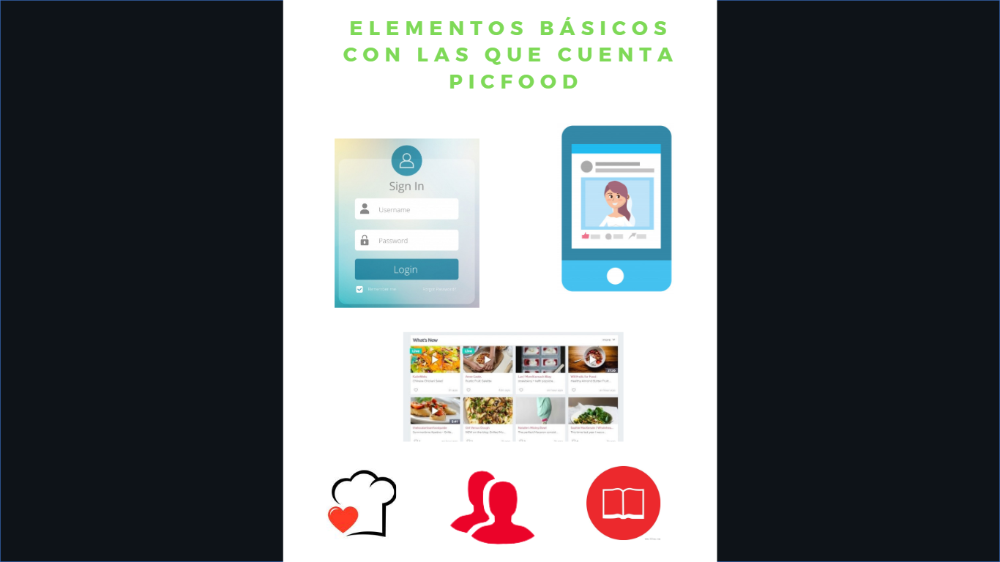
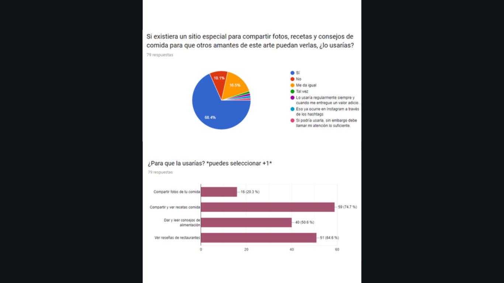
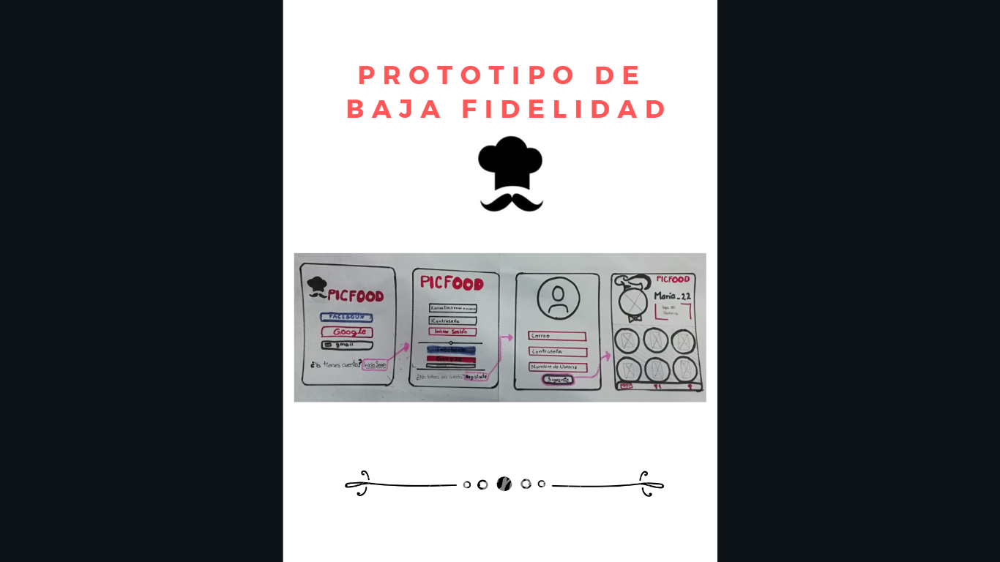

# Picfood
- 

## Índice del proyecto de pagina

- [Introducción](#Introducción)
- [Descripción](#Descripción-del-proyecto)
- [Comenzando](#Comenzando)
- [Información-para-desarrolladores](#Informción-para-desarrolladores)
- [Pre-requisitos](#Pre-requisitos)
- [Instalación](#Instalación)
- [Construido con](#Construido-con)
- [Contribuyendo](#Contribuyendo)
- [Licencia](#Licencia)
- [Agradecimientos](#Agradecimientos)

## Introducción

- 

## Descripción

- 

- 

- 

- 

- 

# Prototipo de Baja Fidelidad

-

# Historias de Usuario

-

# Test de Usabilidad

-

-

-

-

-

## Comenzando

Este proyecto toma los datos de base de datos Fire Store se utilizo el editor de texto de Visual Studio Code, con en lenguaje JavaScript, sobre el marcador de texto HTML, con el lenguaje de diseño grafico CSS, usando bootstrap ; el repositorio original se creo en git hub. A continuación las especificaciones técnicas

##Informción para desarrolladores

Para comenzar este proyecto tendrás que hacer un _fork_ y _clonar_ este
repositorio que contiene el _boilerplate_.

El _boilerplate_ contiene una estructura de archivos como punto de partida así
como toda la configuración de dependencias y tests de ejemplo:

```text
./
├── .firebase
│   ├── hosting.c3Jj.cache
│   └── hosting.cHVibGlj.cache
│
├── functions
│   ├── .gitignore
│   ├── index.js
│   ├── package-lock.json
│   └── package.json
├── src
│   ├── CSS
│   │   ├── index.css
│   │   ├── inicio.css
│   │   └── perfil.css
│   ├── images
│   ├── js
│   │   ├── controladores
│   │   │   └── controlador.js
│   │   ├── libreria.js
│   │   └── rutas.js
│   ├── vistas
│   │   ├── login.html
│   │   ├── muro.html
│   │   └── perfil.html
│   └── index.html
│
├── .DS_Store
├── .eslintrc
├── .firebaserc
├── .gitignore
├── README.md
├── READMEpicfood.md
├── firebase.json
├── package-lock.json
└── package.json
```

## Pre requisitos

Para poder descargar y usar este repositorio se necesita tener:

- un editor de texto.
- una shell para interpretar líneas de comando 
- git

## Instalación 📦

-Hacer un 🍴 fork de este repositorio: https://github.com/KarenAmicone/Social-Network

-Clonar el fork en tu computadora (copia local).

## Construido con 

- GoogleForms 
- Canva
- Javascript
- Bootstrap
- HTML
- CSS
- Firebase

## Contribuyendo

Se agradecerá toda contribución y comentarios a este proyecto.
Para ello necesitas:

- Tener una cuenta en git.

- Haciendo fork en el repositorio de git, clonandolo de manera local en tu pc.

- Crear un repositorio en la cuenta del Github 

## Licencia

- Codigo abierto

## Agradecimientos


Desarrolladoras;

- Diana Gutiérrez
- Fabiola Juárez
- Karen Amicone

## Checklist

### General

* [x] Producto final sigue los lineamientos del diseño.

### `README.md`

* [x] Definición del producto
* [x] Resumen de entrevistas con usuarios.
* [x] Link/screenshots prototipo de baja fidelidad.
* [x] Conclusiones de pruebas con el producto en HTML.

### Pruebas / tests

* [ ] Pruebas unitarios cubren un mínimo del 70% de statements, functions,
  lines, y branches.
* [ ] Pasa tests (y linters) (`npm test`).

### Creación de cuenta (sign up)

* [x] Permite crear cuenta.
* [x] Valida email.
* [x] Valida password.
* [x] Muestra mensajes de error.

### Inicio de sesión (sign in)

* [x] Permite iniciar sesión.
* [x] Valida email.
* [x] Valida password.
* [x] Muestra mensajes de error.

### Muro (wall/feed)

* [x] Muestra _muro_, o lista de publicaciones.
* [x] Permite hacer nuevas publicaciones.
* [x] Permite eliminar publicaciones.
* [x] Pide confirmación antes de borrar publicación.
* [x] Permite editar publicación en el mismo lugar (in place).
* [x] Permite filtrar publicaciones por público/privado.
* [ ] Permite marcar publicaciones como _gustados_ (like, corazón, estrella,
  etc...).
* [ ] Permite ver cuántas marcas, likes, estrellas, corazones o lo que se haya
  elegido, ha recibido una publicación.

### Hacker Edition

* [ ] Permite agregar amigos.
* [ ] Permite eliminar amigos.
* [ ] Permite compartir publicación (en twitter esto es retwittear, en facebook
  es compartir).
* [ ] Permite comentar o responder una publicación.
* [ ] Permite editar perfil.
* [ ] Permite ver perfil o resumen desde el _muro_ o lista de publicaciones.
* [ ] Permite ver cuántas marcas, likes, estrellas, corazones o lo que se haya
  elegido, ha recibido una publicación.